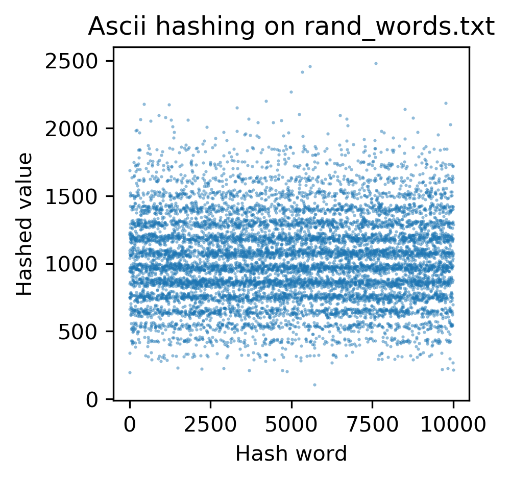
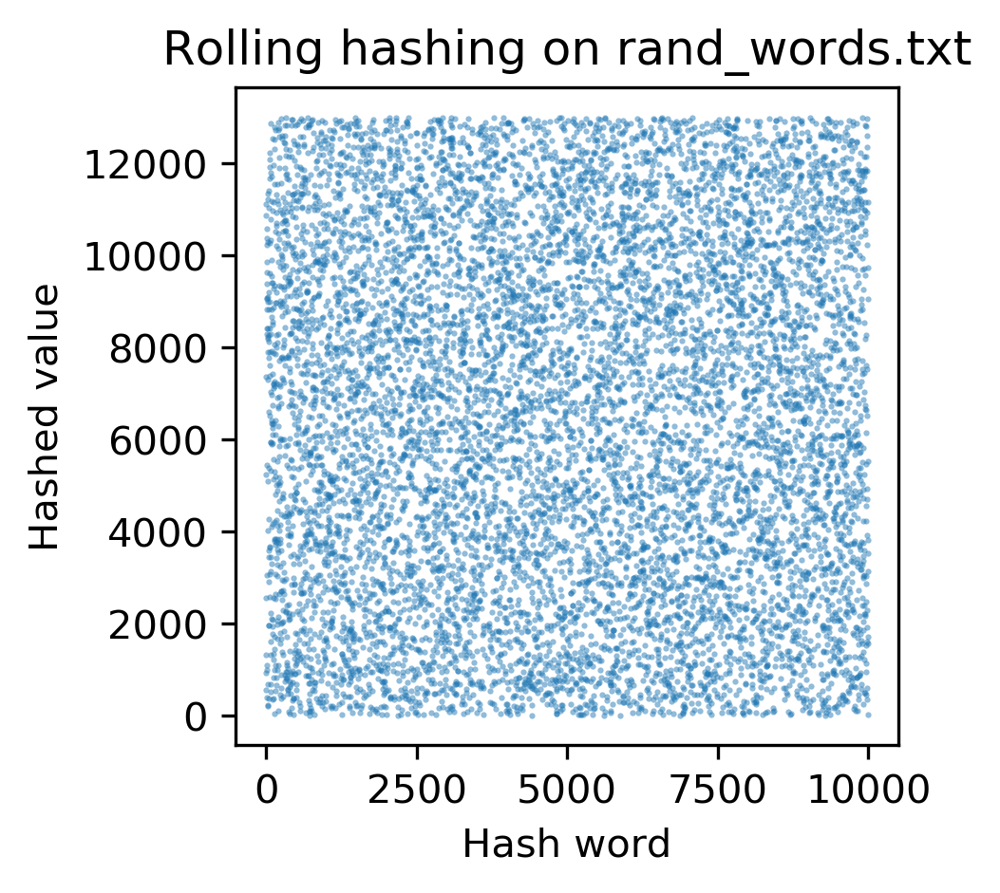
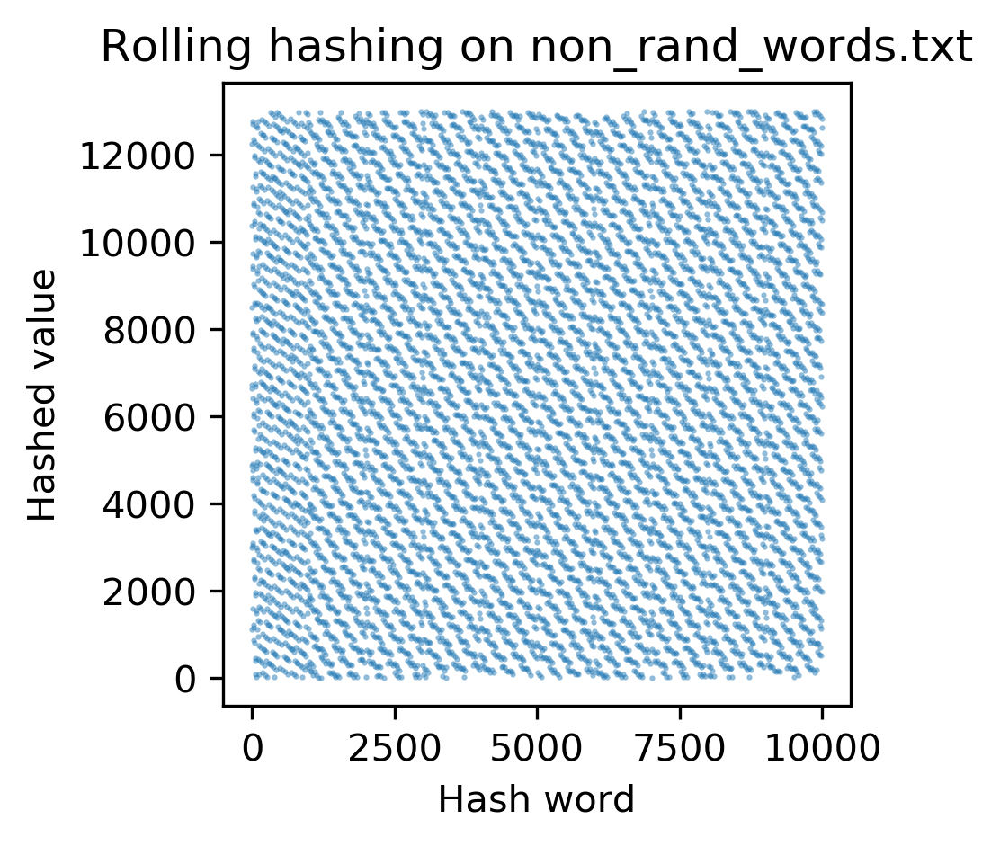
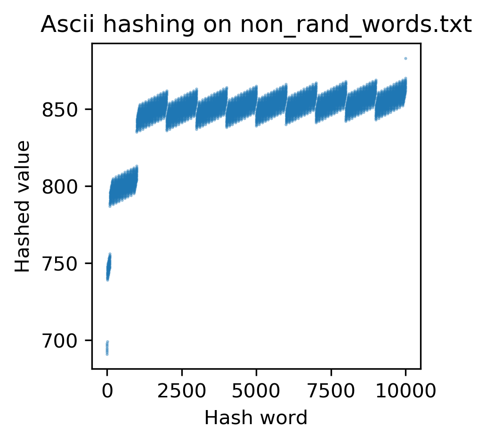
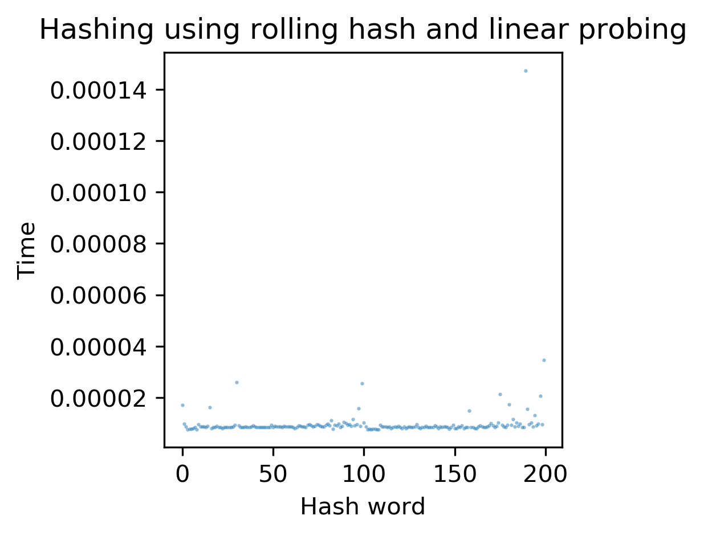
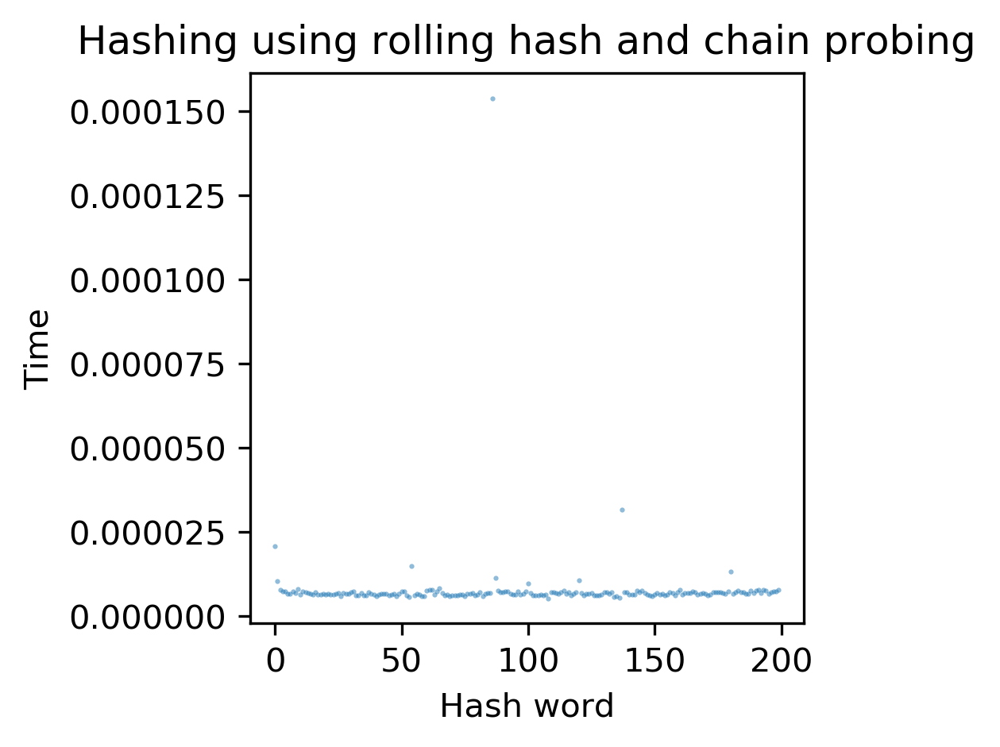
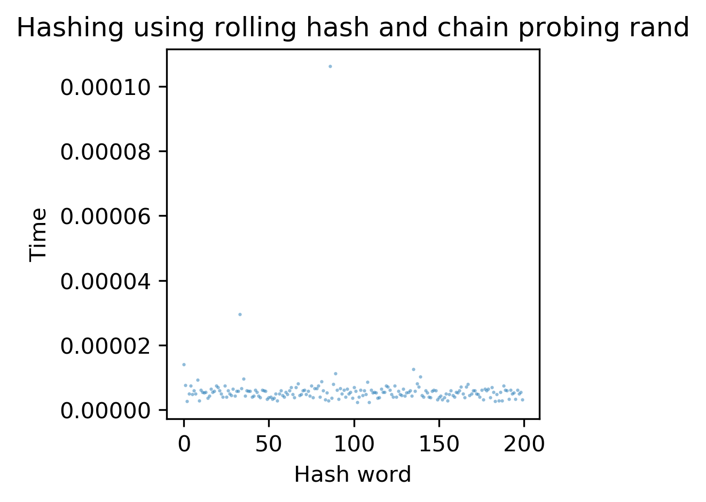

# Hash tables
The first test I did was to try test the hash functions themselves. I started by hashing the words in rand_words.txt using h_ascii hashing. When I did that I seemed to get non random hashes.

When I switch to a rolling hash the data actaully look uniform. 

If I use non-random words I'd expect to see that the hashing is even worse for the Ascii and there is some pattern in the rolling hashes now.

This is actually still pretty random, this seems like a robust type of hashing.

This got really bad, you would not want to use this. 

Then I wanted to see if actually building a hash table was faster with linear or chain probing. So, I tried using using the rolling hash method with eith collison avoidance, I found that chain collison avoidance seemed  faster, and didn't deteriorate when you got near the length of the table.

 

Using random words seems to give you a lot less uniform time to insertion, which isn't particularlly suprising as the system would have to search through and find the right spot to insert.

